# MnemeFusion

**Unified memory engine for AI applications — "SQLite for AI memory."**

MnemeFusion provides multi-dimensional memory indexing (semantic, temporal, causal, entity) in a single embedded database file with zero external dependencies. One library, one `.mfdb` file replaces Qdrant + Neo4j + SQLite.

[](https://www.rust-lang.org/)
[](LICENSE-MIT)

## Features

- **Five Retrieval Pathways**: Semantic vector search, BM25 keyword matching, temporal range queries, causal graph traversal, entity profile scoring
- **Reciprocal Rank Fusion**: Fuses all five dimensions into a single ranked result set
- **Entity Profiles**: LLM-powered entity extraction builds structured knowledge graphs from unstructured text
- **Single File Storage**: All data in one portable `.mfdb` file with ACID transactions (redb)
- **Intent Classification**: Automatic query routing (temporal, causal, entity, factual)
- **Namespace Isolation**: Multi-user memory separation
- **Rust Core**: Memory-safe, high-performance embedded library
- **Python Bindings**: First-class Python API via PyO3
- **Optional GPU Acceleration**: CUDA-accelerated entity extraction via llama-cpp

## Benchmarks

MnemeFusion is evaluated on two established conversational memory benchmarks using standard protocols:

| Benchmark | Protocol | Metric | Questions |
|-----------|----------|--------|-----------|
| [LoCoMo](evals/locomo/) | Free-text + LLM-as-judge | Accuracy | 1,540 (cat 1-4) |
| [LongMemEval](evals/longmemeval/) | Binary yes/no (official paper) | Task-avg accuracy | 500 |

LoCoMo uses a standard free-text + LLM-as-judge protocol (GPT-4o-mini judge, binary CORRECT/WRONG). LongMemEval uses the official paper protocol (gpt-4o-2024-08-06 judge, category-specific prompts). See [evals/](evals/) for methodology details, datasets, and instructions to reproduce.

## Quick Start

### Python

```bash
# Build from source (requires Rust toolchain — pre-built wheels coming soon)
git clone https://github.com/gkanellopoulos/mnemefusion.git
cd mnemefusion/mnemefusion-python
pip install maturin
maturin develop --release
```

```python
import mnemefusion
from sentence_transformers import SentenceTransformer

model = SentenceTransformer("BAAI/bge-base-en-v1.5")

# Open or create a database
mem = mnemefusion.Memory("./brain.mfdb")

# Set embedding function for automatic vectorization
mem.set_embedding_fn(lambda text: model.encode(text).tolist())

# Add memories
mem.add("Alice loves hiking in the mountains", metadata={"speaker": "narrator"})
mem.add("Bob started learning piano last month", metadata={"speaker": "narrator"})

# Multi-dimensional query — returns (intent, results, profile_context)
intent, results, profiles = mem.query("What are Alice's hobbies?", limit=10)

print(f"Intent: {intent['intent']} (confidence: {intent['confidence']:.2f})")
for memory_dict, scores_dict in results:
    print(f"  [{scores_dict['fused_score']:.3f}] {memory_dict['content']}")

# Profile context contains entity facts for RAG augmentation
for fact_str in profiles:
    print(f"  Profile: {fact_str}")
```

### With User Identity

```python
# Namespace isolation + first-person pronoun resolution
mem = mnemefusion.Memory("./brain.mfdb", user="alice")

# Memories are namespaced to "alice"
mem.add("I love hiking in the mountains")

# Map "I"/"me"/"my" → "alice" entity profile at query time
mem.set_user_entity("alice")

# "my hobbies" resolves to alice's profile
intent, results, profiles = mem.query("What are my hobbies?")
```

### With LLM Entity Extraction

Entity extraction uses a local GGUF model (no cloud API needed). Download a supported model:

```bash
# Recommended: Phi-4-mini (3.8B, ~2.3GB, best accuracy)
pip install huggingface-hub
huggingface-cli download microsoft/Phi-4-mini-instruct-gguf Phi-4-mini-instruct-Q4_K_M.gguf --local-dir models/

# Alternative: Qwen3-4B (~2.5GB, good accuracy)
huggingface-cli download Qwen/Qwen3-4B-GGUF qwen3-4b-q4_k_m.gguf --local-dir models/
```

```python
mem = mnemefusion.Memory("./brain.mfdb")
mem.enable_llm_entity_extraction("models/Phi-4-mini-instruct-Q4_K_M.gguf", tier="balanced")

# Entity extraction runs automatically on add()
mem.add("Caroline studies marine biology at Stanford")

# Entity profiles are built incrementally
profile = mem.get_entity_profile("caroline")
# {'name': 'caroline', 'entity_type': 'person', 'facts': {...}, 'summary': '...'}
```

Requires a GPU with 4GB+ VRAM for reasonable speed. CPU-only works but is ~10x slower. Build with `--features entity-extraction-cuda` for GPU acceleration.

### Rust

Add to your `Cargo.toml` (not yet on crates.io — use a git dependency for now):

```toml
[dependencies]
mnemefusion-core = { git = "https://github.com/gkanellopoulos/mnemefusion" }
```

```rust
use mnemefusion_core::{MemoryEngine, Config};

fn main() -> Result<(), Box<dyn std::error::Error>> {
    let engine = MemoryEngine::open("./brain.mfdb", Config::default())?;

    // Add a memory with embedding vector
    let embedding = vec![0.1; 384]; // From your embedding model
    let id = engine.add(
        "Project deadline moved to March 15th".to_string(),
        embedding,
        None, // metadata
        None, // timestamp
    )?;

    // Query with multi-dimensional fusion
    let query_embedding = vec![0.1; 384];
    let (intent, results, profile_facts) = engine.query(
        "When is the project deadline?",
        &query_embedding,
        10,    // limit
        None,  // namespace
        None,  // filters
    )?;

    for result in &results {
        println!("[{:.3}] {}", result.fused_score, result.memory.content);
    }

    engine.close()?;
    Ok(())
}
```

## Architecture



## Python API Reference

### Core Operations

| Method | Description |
|--------|-------------|
| `Memory(path, config=None, user=None)` | Open or create a database |
| `add(content, embedding=None, metadata=None, timestamp=None, source=None, namespace=None)` | Add a memory |
| `query(query_text, query_embedding=None, limit=10, namespace=None, filters=None)` | Multi-dimensional query returning `(intent, results, profiles)` |
| `search(query_embedding, top_k, namespace=None, filters=None)` | Pure semantic similarity search |
| `get(memory_id)` | Retrieve memory by ID |
| `delete(memory_id)` | Delete memory by ID |
| `close()` | Close database and save indexes |

### Batch Operations

| Method | Description |
|--------|-------------|
| `add_batch(memories, namespace=None)` | Bulk insert (10x+ faster) |
| `add_with_dedup(content, embedding, ...)` | Add with duplicate detection |
| `upsert(key, content, embedding, ...)` | Insert or update by logical key |
| `delete_batch(memory_ids)` | Bulk delete |

### Entity & Profile Management

| Method | Description |
|--------|-------------|
| `enable_llm_entity_extraction(model_path, tier="balanced", extraction_passes=1)` | Enable LLM extraction |
| `set_user_entity(name)` | Map first-person pronouns to user entity |
| `list_entity_profiles()` | List all entity profiles |
| `get_entity_profile(name)` | Get profile by name (case-insensitive) |
| `consolidate_profiles()` | Remove noise from profiles |
| `summarize_profiles()` | Generate profile summaries |

### Metadata Filtering

```python
# Filter by metadata key-value pairs (AND logic)
filters = [
    {"metadata_key": "speaker", "metadata_value": "Alice"},
    {"metadata_key": "session", "metadata_value": "2024-01-15"},
]
intent, results, profiles = mem.query("hiking plans", filters=filters)
```

### Namespace System

```python
# Add to specific namespace
mem.add("secret note", namespace="alice")

# Query within namespace
intent, results, profiles = mem.query("notes", namespace="alice")

# Or use the user= constructor shortcut
mem = mnemefusion.Memory("brain.mfdb", user="alice")
# All add/query calls default to the "alice" namespace
```

## Configuration

```python
config = {
    "embedding_dim": 384,              # Must match your embedding model
    "entity_extraction_enabled": True,  # Enable built-in entity extraction
    "llm_model": "path/to/model.gguf", # Auto-enables LLM extraction
    "extraction_passes": 3,             # Multi-pass diverse extraction
    "async_extraction_threshold": 500,  # Defer extraction for large docs
}
mem = mnemefusion.Memory("brain.mfdb", config=config)
```

```rust
use mnemefusion_core::Config;

let config = Config::new()
    .with_embedding_dim(384)
    .with_entity_extraction(true);

let engine = MemoryEngine::open("./brain.mfdb", config)?;
```

## Building from Source

### Prerequisites

- Rust 1.75+
- Python 3.8+ (for Python bindings)

### Build

```bash
git clone https://github.com/gkanellopoulos/mnemefusion.git
cd mnemefusion

# Build core library
cargo build --release

# Run tests (500+ tests)
cargo test -p mnemefusion-core --lib

# Build Python bindings
cd mnemefusion-python
maturin develop --release

# With CUDA GPU support (requires CUDA toolkit)
maturin develop --release --features entity-extraction-cuda
```

## Testing

```bash
# All library unit tests
cargo test -p mnemefusion-core --lib

# With output
cargo test -p mnemefusion-core --lib -- --nocapture

# Run specific test module
cargo test -p mnemefusion-core profile
```

## Language Support

MnemeFusion's core search works with any language via multilingual embeddings. Entity extraction and intent classification are currently English-optimized.

| Feature | Language Support |
|---------|-----------------|
| Vector search | All languages (use multilingual embeddings) |
| BM25 keyword search | English-optimized (Porter stemming) |
| Temporal indexing | All languages |
| Causal links | All languages |
| Entity extraction | English (optional, can be disabled) |
| Metadata filtering | All languages |

For non-English use, disable entity extraction:

```python
config = {"entity_extraction_enabled": False, "embedding_dim": 768}
mem = mnemefusion.Memory("brain.mfdb", config=config)
```

## Contributing

Contributions are welcome! Please open an issue or pull request on GitHub.

## License

Licensed under either of:

- [Apache License, Version 2.0](LICENSE-APACHE)
- [MIT License](LICENSE-MIT)

at your option.

## Acknowledgments

Built on excellent open-source libraries:
- [redb](https://github.com/cberner/redb) — Embedded key-value store
- [usearch](https://github.com/unum-cloud/usearch) — HNSW vector search
- [petgraph](https://github.com/petgraph/petgraph) — Graph algorithms
- [llama-cpp-2](https://github.com/utilityai/llama-cpp-rs) — Rust bindings for llama.cpp
- [PyO3](https://github.com/PyO3/pyo3) — Rust-Python interop

---

**"SQLite for AI memory"** — One file. Five dimensions. Zero complexity.
